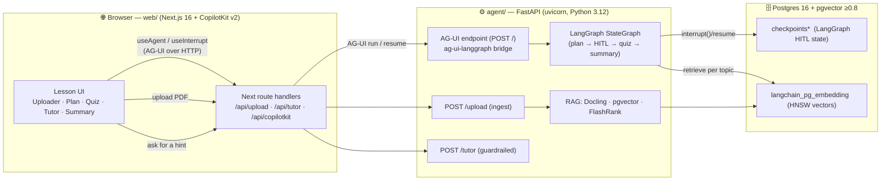
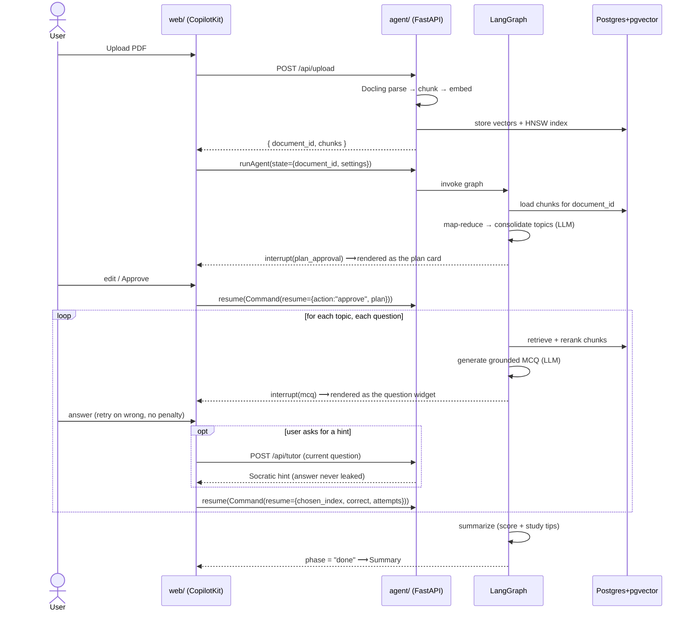
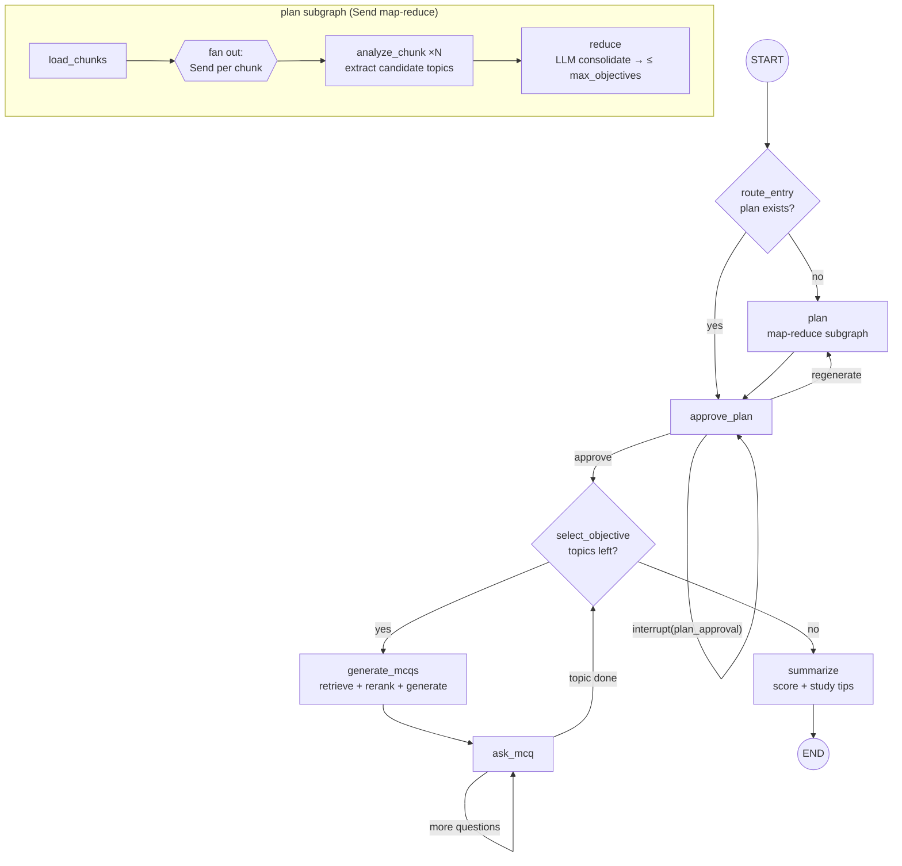
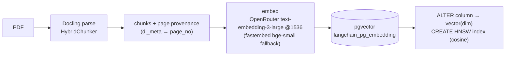
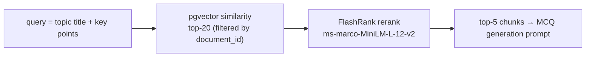
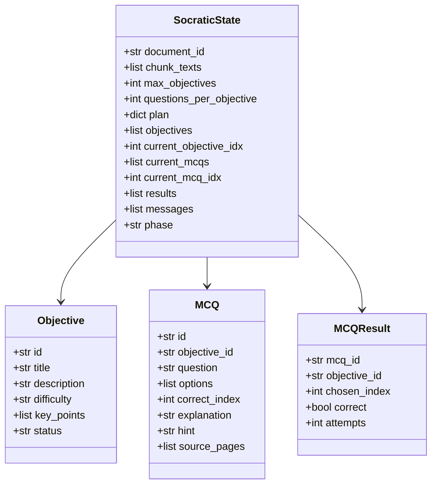
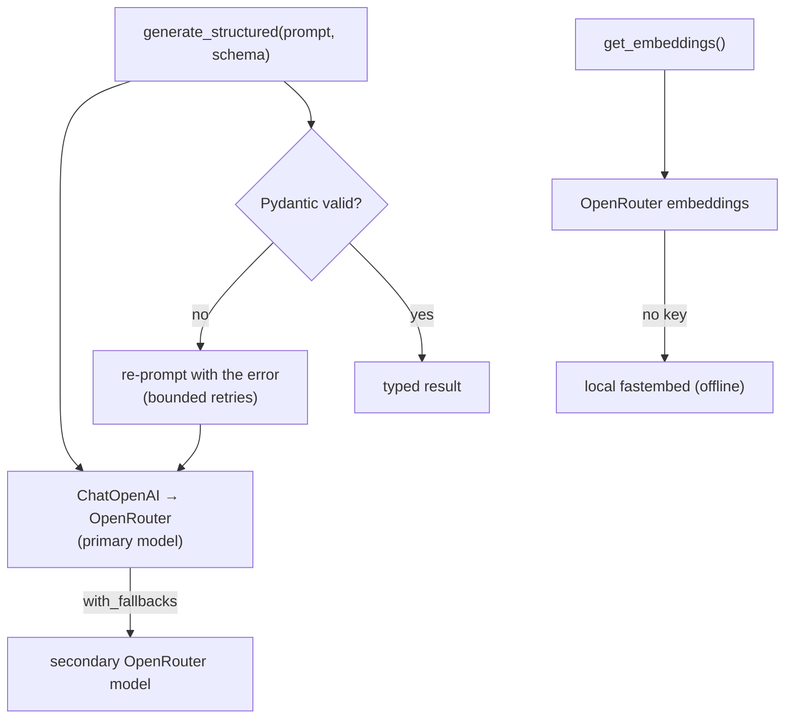
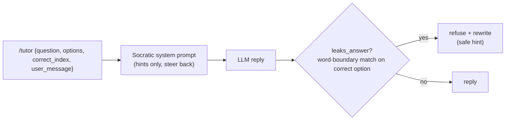
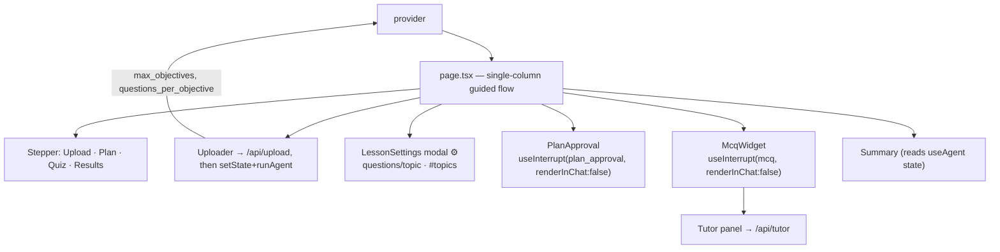
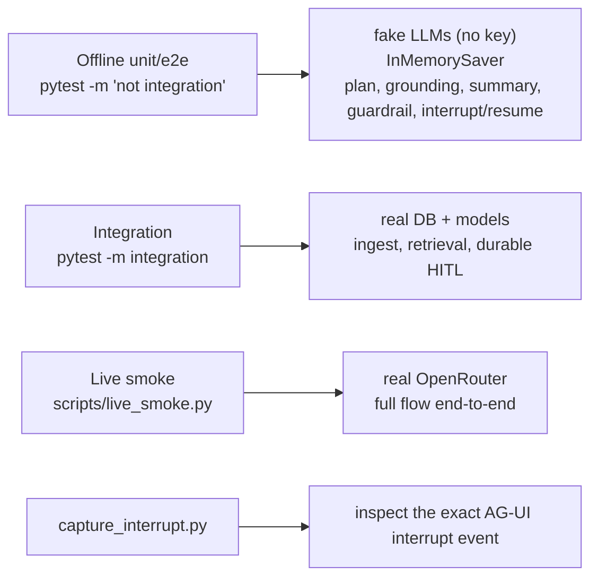

# Architecture

A deep dive into how **Socratic** turns a PDF into a structured, interactive lesson. This document explains the system end-to-end: the services, the agent graph, the human-in-the-loop mechanism, the RAG pipeline, persistence, and the frontend.

---

## 1. Overview

Socratic is a three-service application backed by a single Postgres database:

- **`web/`** — a Next.js + CopilotKit v2 frontend (the guided lesson UI).
- **`agent/`** — a FastAPI service exposing a LangGraph agent over the **AG-UI** protocol, plus two plain HTTP endpoints (`/upload`, `/tutor`).
- **Postgres + pgvector** — does double duty: durable LangGraph checkpoints **and** the RAG vector store.

The pedagogical flow: **upload → plan → approve (HITL) → quiz (per topic) → summary**, with a Socratic tutor that gives hints but never reveals the answer.

---

## 2. Design goals

| Goal | How it's met |
|---|---|
| Structured, persistent pedagogy | A deterministic LangGraph state machine, not a free-form chat |
| Genuine human-in-the-loop | Real LangGraph `interrupt()` + durable Postgres checkpointer (survives restarts) |
| Grounded questions (no hallucinated trivia) | RAG over the PDF with page-level provenance; MCQs cite source pages |
| Scales beyond toy PDFs | Map-reduce planning + per-topic retrieval; nothing holds the whole book in context |
| The "never leak the answer" guarantee | A structural leak-check, not prompt-trust |
| Approachable for non-technical users | Single-column guided flow, plain language, tunable settings in a modal |

---

## 3. System architecture



**Why one Postgres for both roles?** The LangGraph checkpointer (`checkpoints`, `checkpoint_blobs`, `checkpoint_writes`, `checkpoint_migrations`) and the pgvector store (`langchain_pg_embedding`, `langchain_pg_collection`) use disjoint tables. Sharing one instance removes an entire service from the deployment while keeping the two concerns isolated.

---

## 4. End-to-end flow



Every `interrupt()` durably checkpoints to Postgres, so the flow can resume after an agent restart.

---

## 5. The agent graph (LangGraph)

A **custom `StateGraph`** — the flow is deterministic (not LLM-routed), so explicit nodes/edges map naturally to it. `interrupt()` is a first-class citizen.



### Node responsibilities

| Node | File | What it does |
|---|---|---|
| `route_entry` | `graph.py` | Skip planning if a plan is already in state |
| `plan` | `graph.py` → `nodes/plan.py` | Runs the map-reduce subgraph, writes the consolidated `plan` |
| `load_chunks` | `nodes/plan.py` | Loads the document's chunk texts from pgvector (capped) |
| `analyze_chunk` | `nodes/plan.py` | One `Send` per chunk; extracts 1–2 candidate topics in parallel |
| `reduce` | `nodes/plan.py` | **LLM consolidation** of overlapping candidates → ≤ `max_objectives` distinct topics |
| `approve_plan` | `graph.py` | `interrupt(plan_approval)`; routes on approve/regenerate |
| `select_objective` | `nodes/quiz.py` | Next topic, or → summarize when exhausted |
| `generate_mcqs` | `nodes/quiz.py` | Retrieve + rerank chunks → generate `questions_per_objective` grounded MCQs |
| `ask_mcq` | `nodes/quiz.py` | `interrupt(mcq)` per question; records the outcome; loops |
| `summarize` | `nodes/summarize.py` | Progress report + personalized study tips |

### Why map-reduce for planning

A long PDF can't fit in one prompt. The `Send` API fans out one analysis call per chunk (in parallel), accumulates candidate topics via an `operator.add` reducer, then a single **consolidation** call merges semantic duplicates into a clean, capped set ordered foundational → advanced. This is what lets Socratic handle book-length documents rather than toy PDFs.

---

## 6. Human-in-the-loop: how interrupts actually work

Both the plan approval and every quiz question use the **same** mechanism — LangGraph `interrupt()` — discriminated by a `type` field. This unifies the HITL story and makes the whole flow drivable/testable offline.

```mermaid
sequenceDiagram
    participant G as LangGraph node
    participant B as ag-ui-langgraph bridge
    participant CK as CopilotKit (useInterrupt)
    participant UI as React widget

    G->>G: value = interrupt(payload)
    Note over G: graph SUSPENDS here
    G->>B: pending interrupt
    B->>CK: AG-UI CUSTOM event "on_interrupt"<br/>value = JSON STRING
    CK->>UI: enabled(event) then render(event)
    Note over UI: JSON.parse(event.value) → object<br/>(the value is a STRING — must parse)
    UI->>UI: user interacts (edit plan / answer)
    UI->>CK: resolve(payload)
    CK->>B: forwardedProps.command.resume = payload
    B->>G: Command(resume=payload)
    Note over G: graph RESUMES; interrupt() returns the payload
```

**Two gotchas baked into the implementation:**

1. **The interrupt value is a JSON _string_.** The `ag-ui-langgraph` bridge serializes `interrupt.value` with `dump_json_safe`, so the frontend receives `event.value` as a string. The widgets `JSON.parse` it (`web/src/lib/utils.ts → parseInterruptValue`) before reading `.type`. (Skipping this silently breaks rendering.)
2. **Nodes re-run top-to-bottom on resume.** So `interrupt()` is the first meaningful statement in `approve_plan_node` / `ask_mcq_node`, and everything before it is idempotent state reads — no double side effects.

**The two contracts (kept byte-for-byte across `agent/src/nodes` ↔ `web/src/components`):**

| Interrupt | Agent → UI payload | UI → agent (resume) |
|---|---|---|
| Plan | `{type:"plan_approval", plan:[Objective…]}` | `{action:"approve"\|"regenerate", plan:[…], feedback}` |
| Quiz | `{type:"mcq", mcq:{question, options, correct_index, explanation, hint, source_pages, …}}` | `{chosen_index, correct, attempts}` |

The MCQ retry loop (wrong → red + hint → try again) runs **entirely client-side**; `resolve()` is only called once the question is finished, so the graph stays cleanly suspended on a single pending interrupt the whole time.

---

## 7. RAG pipeline

### Ingestion (`/upload`, runs out-of-band so heavy I/O never blocks the agent loop)



- **Docling** is chosen for parsing because it carries `page_no` + section headings into each chunk's metadata — that provenance becomes the MCQ's source-page citation.
- The pgvector column is created un-dimensioned by LangChain, so ingestion dimensions it (`ALTER … vector(N)`) and builds the **HNSW** index (`m=16, ef_construction=200`, cosine) once. A guard raises a clear error if you switch embedding models against a populated DB (different dimension).
- On Apple Silicon, Docling is pinned to CPU (`settings.docling_device`) to dodge an MPS float64 crash; configurable for CUDA hosts.

### Retrieval (per topic, at quiz time)



"Retrieve broadly, rank precisely" — 20 candidates reranked down to the 5 most relevant. The reranker is local and free (no extra API key). MCQ generation is constrained to cite only the provided chunks' pages, so questions stay grounded.

---

## 8. State model & persistence

### `SocraticState` (the graph's working memory)

Stored as **JSON-native dicts**, not Pydantic instances. This keeps the LangGraph msgpack checkpoint clean (no "unregistered type" warnings on a durable Postgres round-trip) and keeps state serializable for the AG-UI wire format. Nodes re-validate with `Model(**d)` at the boundary where they need typed access.



> `max_objectives` (default 6) and `questions_per_objective` (default 2) are the UI-tunable settings. `results` uses an `operator.add` reducer (accumulates across the quiz) and `messages` uses the LangGraph `add_messages` reducer. `options` is always exactly 4.

### Durable checkpointer

`AsyncPostgresSaver` is built in the FastAPI **lifespan** (it pins to the running event loop, so it can't be constructed at import). It's attached to the compiled graph at startup; `interrupt()`/resume reads and writes the thread's checkpoint, so the lesson survives an agent restart.

---

## 9. LLM / provider layer (`llm.py`)



- **OpenRouter only** (no OpenAI key). Default chat `openai/gpt-4o-mini`, with a secondary OpenRouter model as fallback.
- Structured output uses `with_structured_output(method="function_calling")` for the widest model compatibility, wrapped in a **Pydantic-ValidationError retry loop** (the agent's structured calls are why the internal LLM tool-calls exist — they're suppressed in the UI).
- Embeddings via OpenRouter with a local **fastembed** fallback so it runs offline / key-free.

---

## 10. The Socratic tutor & guardrail (`tutor.py`, `/tutor`)

A **separate endpoint**, not part of the quiz graph — so it never touches the suspended graph state and is independently testable.



The guardrail is **structural**: even if the model tries to reveal the answer, `leaks_answer()` detects the correct option's text and replaces the response with a safe hint. This is covered by a unit test that monkeypatches the model to deliberately leak.

---

## 11. Frontend architecture (`web/`)

CopilotKit v2 over the **AG-UI** protocol. The frontend keeps the CopilotKit provider for `useAgent` (kickoff + shared state) and `useInterrupt` (the HITL widgets), but **renders its own UI** — there is no `CopilotChat` surface (it would render the agent's internal tool-calls as JSON).



- **`renderInChat: false`** → `useInterrupt` returns the element, and the page places it in the active-step area (not in a chat). This is what moved the widgets into a clean lesson panel.
- The Next route handlers (`/api/upload`, `/api/tutor`) proxy to the Python service server-side to avoid browser CORS.
- Motion follows Emil Kowalski's craft principles: custom `ease-out` curve, sub-300ms UI transitions, staggered card entrances, press-scale on buttons, `prefers-reduced-motion` support.

---

## 12. Configuration & tunables

| Setting | Where | Default | Surfaced in UI |
|---|---|---|---|
| Questions per topic | `questions_per_objective` (state) | 2 | ⚙ modal (1–5) |
| Number of topics | `max_objectives` (state) | 6 | ⚙ modal (3–8) |
| Chat model | `OPENROUTER_MODEL` | `openai/gpt-4o-mini` | env |
| Embedding model | `EMBED_MODEL` / `EMBED_DIMENSIONS` | `text-embedding-3-large` / 1536 | env |
| Tracing | `LANGSMITH_TRACING` / `LANGSMITH_API_KEY` | off | env |
| Docling device | `settings.docling_device` | `cpu` | env |

The two lesson tunables flow from the ⚙ modal → React context → `agent.setState()` at kickoff → graph state → `plan.py` (cap) and `quiz.py` (count).

---

## 13. Testing strategy



The bulk of the suite is **fast and offline** (monkeypatched `generate_structured`/`retrieve`, `InMemorySaver`), so the graph logic, grounding constraints, the answer-leak guardrail, and interrupt/resume are all verified without keys or a DB.

---

## 14. Key technology decisions

| Concern | Choice | Why |
|---|---|---|
| Agent framework | LangGraph custom `StateGraph` | Deterministic flow; first-class `interrupt()` |
| Frontend ↔ agent | CopilotKit v2 + AG-UI (`LangGraphHttpAgent`) | Streaming state + interrupt widgets; HTTP bridge to FastAPI |
| PDF parsing | Docling `HybridChunker` | Page/heading provenance for citations |
| Vector store | pgvector (HNSW, cosine) | Same Postgres as the checkpointer; no extra service |
| Reranker | FlashRank (local) | Highest-ROI retrieval upgrade, zero cost/key |
| LLM/embeddings | OpenRouter (+ fastembed fallback) | Single key, provider-agnostic, offline-capable |
| Checkpointer | `AsyncPostgresSaver` | Durable `interrupt()`/resume |
| Structured output | `with_structured_output` + Pydantic retry | Reliable schemas across heterogeneous models |
| Guardrail | structural leak-check | Beats prompt-trust; unit-tested |

---

## 15. Running it

See **`CLAUDE.md`** for the full quickstart and test commands. In short:

```bash
cp agent/.env.example agent/.env     # set OPENROUTER_API_KEY
docker compose up -d db              # Postgres + pgvector
cd agent && PYTHONPATH=. uv run uvicorn main:app --port 8123
cd web   && npm run dev              # http://localhost:3000
```

Deliberate non-goals (documented for honesty): multi-user auth, OCR for scanned PDFs, a managed reranker, a background ingestion queue, and anti-cheat server-side grading — each is a conscious scope cut with a clear path to add later.
