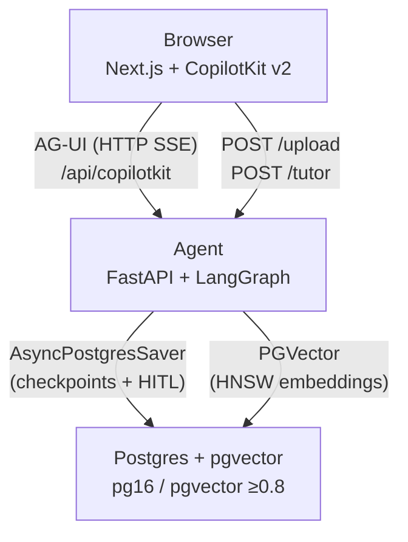

# Socratic

**Turn any PDF into a structured, interactive lesson — with a plan you approve, grounded MCQs, a Socratic tutor that never reveals the answer, and a personalized summary.**

> 🎥 **Walkthrough:** _(Loom link — TBD)_

---

## The problem

ChatGPT and Gemini are capable conversationalists, but they lack a **structured, persistent pedagogical flow**: they don't propose a learning plan before teaching, don't pause for your input before generating content, and don't enforce a "never give away the answer" constraint while you're still trying to figure it out. Socratic fills that gap — it treats a PDF as curriculum, builds a lesson plan collaboratively with you, quizzes you on the material, and then summarizes how you did.

---

## Demo flow

1. **Upload** — drop a PDF; the agent parses and embeds it out-of-band, then the lesson begins.
2. **Plan** — the agent fans out over document chunks (map-reduce), consolidates learning objectives, and surfaces them as an editable todo list.
3. **Approve** — a LangGraph `interrupt()` suspends the graph; you review, edit, or ask for a regeneration. The graph only continues after your explicit approval.
4. **Quiz** — for each objective, the agent retrieves and reranks relevant chunks, generates grounded MCQs with source-page citations, and presents them one at a time as an interactive radio widget. Correct answer: green feedback + explanation + Continue. Incorrect: red + hint + retry (no penalty; the graph stays suspended until you finish).
5. **Summary** — a personalized progress report and study tips weighted toward your weakest objectives.

At any point during the quiz you can message the Socratic tutor. It gives conceptual hints and explanations — and is structurally prevented from leaking the correct option.

---

## Architecture



Three services, **one Postgres doing double duty**: the same database holds the LangGraph checkpoint tables (durable HITL, survives restarts) and the pgvector embedding store (RAG). The agent is a FastAPI app that exposes the LangGraph graph over the AG-UI protocol; CopilotKit v2 on the Next.js side handles streaming state, renders interrupt widgets, and hosts a chat panel.

---

## Tech stack

| Component | Choice | Why |
|---|---|---|
| Agent framework | LangGraph `StateGraph` (custom, not `create_react_agent`) | Deterministic flow maps naturally to explicit nodes/edges; `interrupt()` is first-class |
| Web framework | Next.js 15 (App Router) + CopilotKit v2 | AG-UI protocol + `useInterrupt` for durable HITL widgets; `CopilotChat` for tutor chat |
| AG-UI adapter | `LangGraphAGUIAgent` + `add_langgraph_fastapi_endpoint` | Official CopilotKit ↔ LangGraph HTTP bridge |
| PDF parse | Docling `HybridChunker` via `langchain-docling` | Structured extraction with page/heading provenance carried through to MCQ citations |
| Vector store | `langchain-postgres` PGVector (HNSW, cosine) | Same Postgres instance as the checkpointer; avoids an extra service |
| Reranker | FlashRank `ms-marco-MiniLM-L-12-v2` (local) | Zero-cost, offline, no extra API key; k=20 → top_n=5 |
| LLM / embeddings | OpenRouter (`gpt-4o-mini` primary, `claude-3.5-sonnet` fallback) | Single API key, provider-agnostic; `text-embedding-3-large` @ 1536d via same key |
| Checkpointer | `AsyncPostgresSaver` (psycopg3 async pool) | Required for durable `interrupt()`/resume; hot-swapped into the graph at startup |
| Observability | LangSmith (env-only, optional) | Auto-traces every node, LLM call, interrupt, and structured-output retry |
| Tests | pytest + `GenericFakeChatModel` + `InMemorySaver` | Fully offline fast layer; real-IO tests behind `-m integration` marker |

---

## Quickstart

**Prerequisites:** Docker, [`uv`](https://docs.astral.sh/uv/), Node 20+.

### 1. Environment

```bash
cp agent/.env.example agent/.env
```

Open `agent/.env` and set at minimum:

```
OPENROUTER_API_KEY=sk-or-...   # required — chat + embeddings
LANGSMITH_API_KEY=ls__...      # optional — tracing in LangSmith
```

### 2. Start Postgres

```bash
docker compose up -d db
```

This starts `pgvector/pgvector:pg16` on port 5432. The agent creates its tables (LangGraph checkpointer + pgvector collection) automatically on first run.

### 3. Start the agent

```bash
cd agent
uv sync
uv run uvicorn main:app --port 8123
```

The agent starts on `http://localhost:8123`. On the first PDF upload, Docling downloads its ML models (~1 GB, one-time cache).

### 4. Start the web app

```bash
cd web
npm install
npm run dev
```

Open **http://localhost:3000**.

---

### Full stack via Docker Compose

```bash
docker compose up
```

This builds and runs all three services (db, agent, web). Note: the agent image is substantial (~3–4 GB) due to Docling and its PyTorch layout models being baked in at build time (`docling-tools models download`). Suitable for a one-command demo; for fast iteration, run the agent locally with `uv` and only `docker compose up -d db`.

---

## How it works

### The LangGraph graph

The graph is a custom `StateGraph` (not `create_react_agent`) because the flow is deterministic:

```
START → route_entry → plan (Send map-reduce)
                         ↓
                    approve_plan  ←──── regenerate ──────┐
                         ↓ approve                        │
                    select_objective                       │
                    ↙              ↘                      │
             (done)            generate_mcqs              │
               ↓                    ↓                     │
           summarize → END      ask_mcq ⟲ (per MCQ)      │
                                    ↓ objective done       │
                              select_objective ────────────┘
```

**Planning** uses `Send` map-reduce: the document's chunks are fanned out to parallel `analyze_chunk` branches, each extracting candidate objectives; a fan-in reducer consolidates them into a typed `Plan`. This scales to book-length PDFs without loading everything into one context window (capped at 40 chunks for cost control).

### Durable HITL via `interrupt()` and Postgres

Both human-in-the-loop steps — plan approval and each MCQ — use LangGraph `interrupt()` with a `type` discriminator in the payload. The Postgres `AsyncPostgresSaver` serializes the entire graph state to the database at each checkpoint, so the agent survives a process restart mid-lesson. The frontend resolves interrupts via CopilotKit's `useInterrupt` hook, which sends a `Command(resume=...)` back to the server.

### RAG: Docling → pgvector HNSW → FlashRank

1. **Parse** — `DoclingLoader` with `HybridChunker` extracts text chunks with `page_no` and heading provenance preserved in metadata.
2. **Embed + store** — `OpenAIEmbeddings` via OpenRouter → `PGVector` (cosine, JSONB metadata). After insert, an HNSW index (`m=16, ef_construction=200`) is created or validated, with a dimension guard that catches model-switching bugs early.
3. **Retrieve** — per objective: 20 candidates from pgvector (filtered by `document_id`) → `FlashrankRerank` → top 5 passages. These passages ground MCQ generation and supply source-page citations.

### The Socratic answer-leak guardrail

The `/tutor` endpoint accepts the current question, options, and correct index. After the model generates its hint, a **structural leak-check** (`src/tutor.py: leaks_answer`) scans the response with a word-boundary regex for the exact correct option text. If the model leaked it — regardless of prompt — the response is replaced with a warm steer-back message. The guardrail does not rely on prompt discipline alone.

---

## Acceptance criteria → where implemented

| # | Criterion | Implementation |
|---|---|---|
| 1 | Agent accepts PDF upload and parses relevant content | `POST /upload` → `src/ingest.py`: Docling `HybridChunker` → pgvector |
| 2 | Agent presents a plan (todo list) | `src/nodes/plan.py`: `Send` map-reduce → `Plan{objectives[]}` |
| 3 | HITL interrupt: user reviews plan before proceeding | `src/graph.py: approve_plan_node` — `interrupt({"type":"plan_approval",...})` + `web/src/components/PlanApproval.tsx` (`useInterrupt`) |
| 4 | MCQs generated directly from PDF content | `src/nodes/quiz.py: generate_mcqs_node` — per-objective retrieval + structured output with `source_pages` citations |
| 5 | MCQ genUI widget renders with radio selection | `web/src/components/McqWidget.tsx` — custom `useInterrupt` widget with radio buttons |
| 6 | On correct answer, explanation displayed | `McqWidget.tsx`: green feedback + explanation text on correct selection before Continue |
| 7 | On incorrect, hint displayed + retry without penalty | `McqWidget.tsx`: red feedback + hint + Try Again; `respond()` not called until question is resolved — graph stays suspended, no penalty |
| 8 | Users proceed through all generated MCQs until completion | `src/graph.py`: `ask_mcq` loops within objective; `select_objective` advances until all objectives exhausted |
| 9 | Agent provides summary of results + study tips | `src/nodes/summarize.py` + `web/src/components/Summary.tsx` — per-objective scores, attempt counts, personalized tips |

---

## Testing

```bash
cd agent
uv run pytest -m "not integration"   # fast, fully offline — uses fakes + InMemorySaver
```

Notable tests:
- **`test_guardrail.py`** — asserts the tutor cannot leak the correct option under adversarial model output; tests the `leaks_answer` regex directly and the `tutor_answer` rewrite path.
- **`test_interrupt.py`** + **`test_durable_hitl_integration.py`** — invoke → assert `__interrupt__` populated → `Command(resume=...)` → assert approved state + edited objectives applied.
- **`test_mcq_grounding.py`** — `correct_index` in range, exactly 4 options, `source_pages` non-empty.
- **`test_e2e_happy.py`** — tiny synthetic PDF → plan → approve → quiz → summary with a fake chat model.

Integration tests (need DB + Docling models):

```bash
uv run pytest -m integration
```

---

## Deliberate non-goals and production roadmap

These are scope choices, not omissions. Each has a clear production path:

| Non-goal | Rationale | Production path |
|---|---|---|
| Auth / multi-user | Single-session POC; each browser tab gets its own `thread_id` | Per-user `thread_id` scoping + Postgres row-level security |
| OCR for scanned PDFs | Docling handles text-layer PDFs; scanned PDFs are a separate input class | Tesseract/EasyOCR opt-in pipeline stage before Docling |
| Managed reranker | FlashRank is free and local; sufficient for a demo | Cohere Rerank or Voyage with NDCG@5 offline eval |
| Server-side MCQ grading (anti-cheat) | `correct_index` in tool args enables instant client feedback; fine for a tutoring POC | Grade server-side via `respond()` round-trip; never ship `correctIndex` to the client |
| Background ingestion queue | `run_in_threadpool` is adequate for single-user; blocks the event loop for concurrent uploads | Celery/ARQ task queue with progress webhooks |
| Spaced repetition / cross-session memory | Out of scope for single-lesson flow | LangGraph `Store` API for per-user long-term memory; SM-2 scheduling |
| Eval harness | LangSmith tracing covers development; a formal eval suite is a separate workstream | Ragas for RAG quality (faithfulness, answer relevance); LangSmith datasets for regression |
| Cloud deployment | Left deploy-ready (Dockerfiles, env-driven config) but not deployed | Fly.io / Railway for agent + db; Vercel for web; secrets via platform env |

---

## Project structure

```
socratic/
├── agent/
│   ├── main.py                 # FastAPI: AG-UI endpoint, /upload, /tutor, /health
│   ├── src/
│   │   ├── graph.py            # StateGraph: nodes, edges, compile(checkpointer)
│   │   ├── state.py            # SocraticState (TypedDict) + Pydantic schemas
│   │   ├── ingest.py           # Docling → HybridChunker → embed → pgvector + HNSW
│   │   ├── retrieval.py        # pgvector k=20 → FlashRank top_n=5
│   │   ├── tutor.py            # Socratic hint endpoint + answer-leak guardrail
│   │   ├── llm.py              # OpenRouter chat + embeddings; structured-output helper
│   │   ├── settings.py         # pydantic-settings (env)
│   │   └── nodes/
│   │       ├── plan.py         # Send map-reduce planning subgraph
│   │       ├── quiz.py         # select_objective, generate_mcqs, ask_mcq
│   │       └── summarize.py    # per-objective scoring + study tips
│   ├── tests/                  # pytest suite (unit + integration markers)
│   ├── pyproject.toml          # uv-managed dependencies
│   └── Dockerfile              # prefetches Docling + FlashRank models at build time
├── web/
│   └── src/
│       ├── app/
│       │   ├── layout.tsx      # CopilotKit provider + v2 CSS
│       │   ├── page.tsx        # Uploader + CopilotChat + widgets
│       │   └── api/
│       │       ├── copilotkit/ # CopilotRuntime route (LangGraphHttpAgent)
│       │       ├── upload/     # proxy → agent /upload
│       │       └── tutor/      # proxy → agent /tutor
│       ├── components/
│       │   ├── Uploader.tsx
│       │   ├── PlanApproval.tsx
│       │   ├── McqWidget.tsx
│       │   ├── Progress.tsx
│       │   └── Summary.tsx
│       └── hooks/ lib/ ui/
├── docker-compose.yml          # postgres(pgvector) + agent + web
└── docs/superpowers/specs/     # design spec + architecture notes
```
